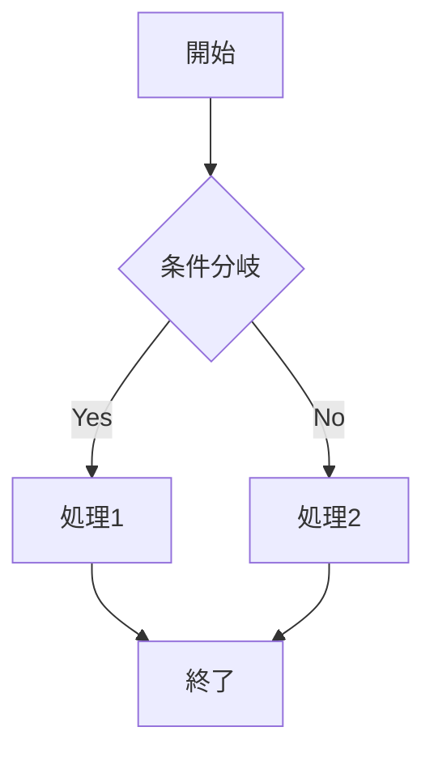
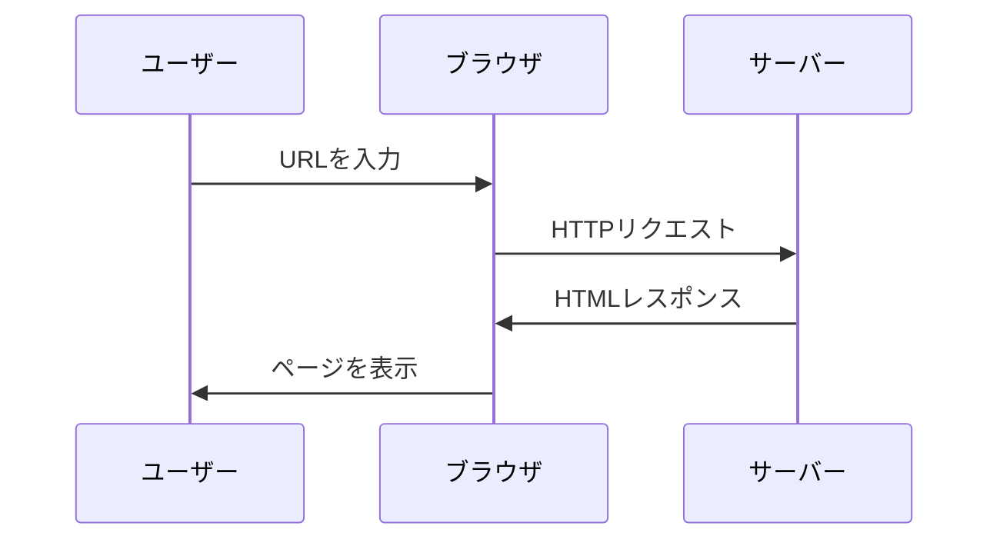
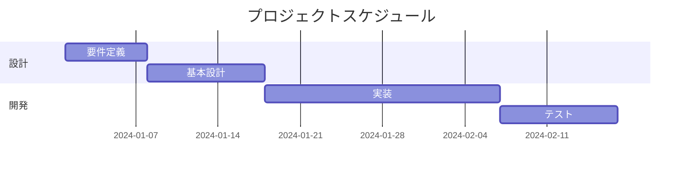

# KaTeXとMermaid.js テスト

## 数式テスト (KaTeX)

### インライン数式

アインシュタインの有名な式: $E = mc^2$

円周率: $\pi \approx 3.14159$

### ブロック数式

ガウス積分:

$$
\int_{-\infty}^{\infty} e^{-x^2} dx = \sqrt{\pi}
$$

二次方程式の解の公式:

$$
x = \frac{-b \pm \sqrt{b^2 - 4ac}}{2a}
$$

オイラーの等式:

$$
e^{i\pi} + 1 = 0
$$

---

## 図表テスト (Mermaid)

### フローチャート



### シーケンス図



### ガントチャート



---

## 組み合わせテスト

数式とコードブロックの混在:

Pythonで数式を計算:

```python
import math

# 円の面積を計算
radius = 5
area = math.pi * radius ** 2
print(f"半径{radius}の円の面積: {area}")
```

円の面積の公式: $A = \pi r^2$

---

## 複雑な数式

行列:

$$
\begin{pmatrix}
a & b \\
c & d
\end{pmatrix}
\begin{pmatrix}
x \\
y
\end{pmatrix}
=
\begin{pmatrix}
ax + by \\
cx + dy
\end{pmatrix}
$$

総和記号:

$$
\sum_{i=1}^{n} i = \frac{n(n+1)}{2}
$$
